# 🚀 vProfile: Jenkins + Elastic Beanstalk CI/CD Pipeline (Staging)

This branch contains the **staging CI/CD pipeline** that replaces the Ansible+EC2 deployment model with **AWS Elastic Beanstalk**, eliminating manual server management entirely.

---

## 🆕 What's New vs Ansible Pipeline

| Feature | Jenkins + Ansible | Jenkins + Beanstalk |
| :--- | :--- | :--- |
| App server management | Manual (Tomcat on EC2) | Fully managed by Beanstalk |
| Deployment method | Ansible playbook | AWS CLI → S3 → Beanstalk |
| Artifact storage | Nexus only | Nexus + S3 |
| Infrastructure provisioning | Ansible + userdata scripts | Beanstalk handles it |
| AWS credentials in Jenkins | Not needed | `awsbeancreds` (IAM) |

---

## 🏗 Architecture

```
GitHub Push → Jenkins → Maven Build → SonarQube → Quality Gate
                                                        ↓
                                              Nexus (versioned .war)
                                                        ↓
                                              S3 (vprofile-cicd-bean)
                                                        ↓
                                      Beanstalk create-application-version
                                                        ↓
                                        Beanstalk update-environment
                                         (Vpro-bean-env - staging)
                                                        ↓
                                              Slack Notification
```

---

## 🚀 Pipeline Stages

1. **Build** — `mvn -s settings.xml -DskipTests install`
2. **Test** — `mvn -s settings.xml test`
3. **Sonar Analysis** — SonarScanner with quality profile checks
4. **Quality Gate** — aborts pipeline if standards not met
5. **Upload Artifact** — `.war` versioned as `BUILD_ID-TIMESTAMP` pushed to Nexus
6. **Deploy to Stage Bean**:
   - Upload `vprofile-v${BUILD_ID}.war` to S3
   - Create Beanstalk application version from S3 object
   - Update `Vpro-bean-env` with the new version

---

## ⚙️ Environment Variables

| Variable | Value |
| :--- | :--- |
| `ARTIFACT_NAME` | `vprofile-v${BUILD_ID}.war` |
| `AWS_S3_BUCKET` | `vprofile-cicd-bean` |
| `AWS_EB_APP_NAME` | `vpro-beanstalk` |
| `AWS_EB_ENVIRONMENT` | `Vpro-bean-env` |
| `AWS_EB_APP_VERSION` | `${BUILD_ID}` |

---

## 🔧 Jenkins Setup Requirements

- **Credentials**: `awsbeancreds` — AWS IAM credentials with S3 and Beanstalk permissions
- **Plugin**: `Pipeline: AWS Steps` (`withAWS`)
- **Tools**: `JDK11`, `MAVEN3.9`, `sonarscanner`
- **Webhook**: GitHub webhook pointing to `http://<jenkins-ip>:8080/github-webhook/`

---

## 📦 AWS Prerequisites

- S3 bucket: `vprofile-cicd-bean`
- Elastic Beanstalk application: `vpro-beanstalk`
- Beanstalk staging environment: `Vpro-bean-env` (Tomcat platform)
- IAM user with `AmazonS3FullAccess` and `AdministratorAccess-AWSElasticBeanstalk`

---

## 📸 Screenshots

### Architecture
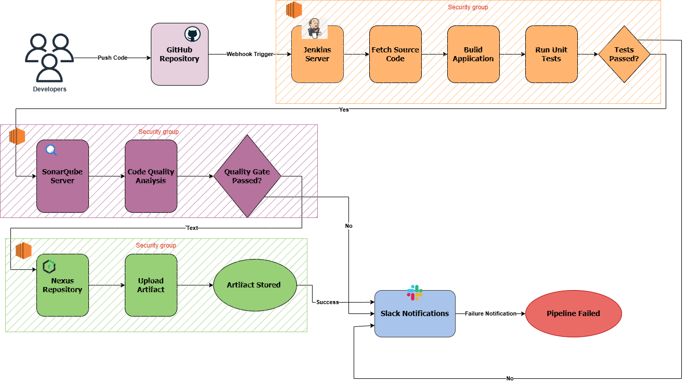

### Jenkins Successful Build
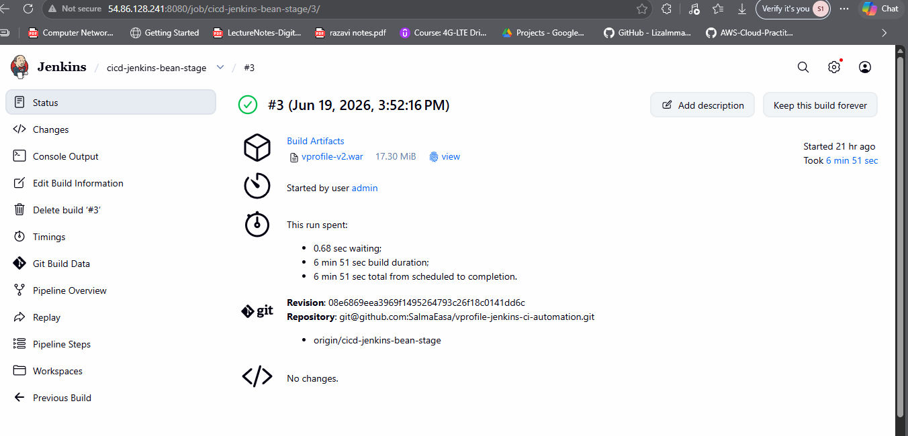

### SonarQube Analysis
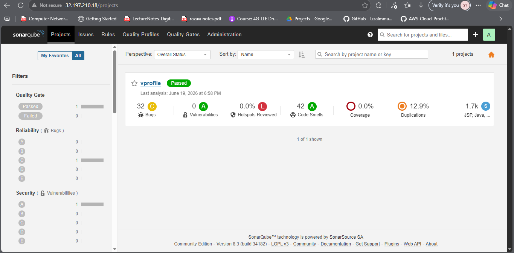

### Nexus Artifact
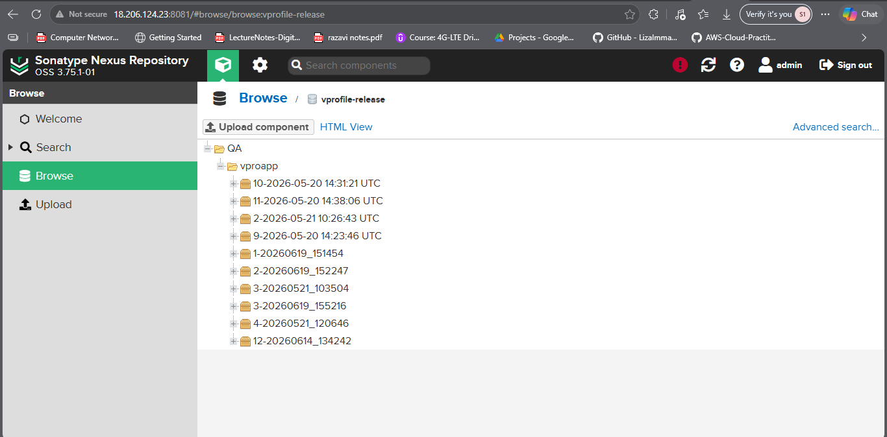

### S3 Artifact Upload
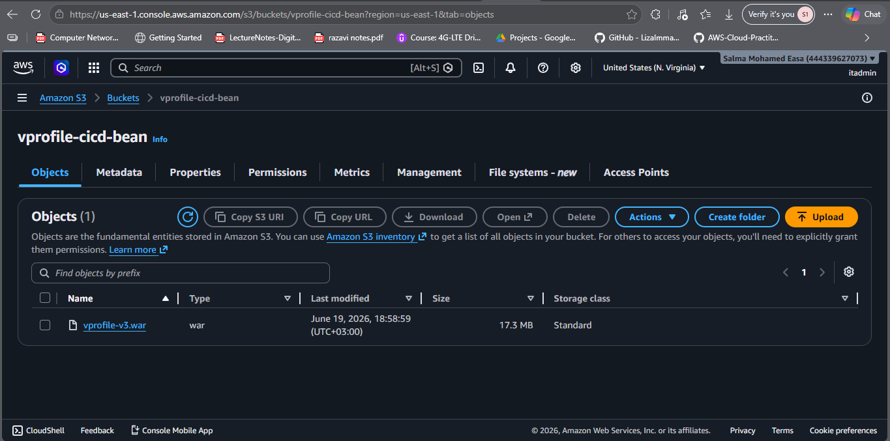

### Beanstalk Environments
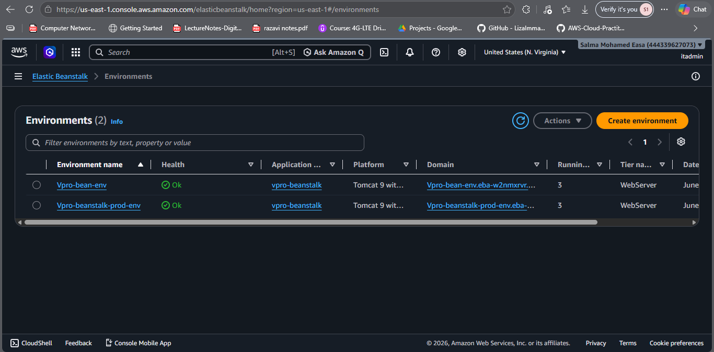

### Application Versions
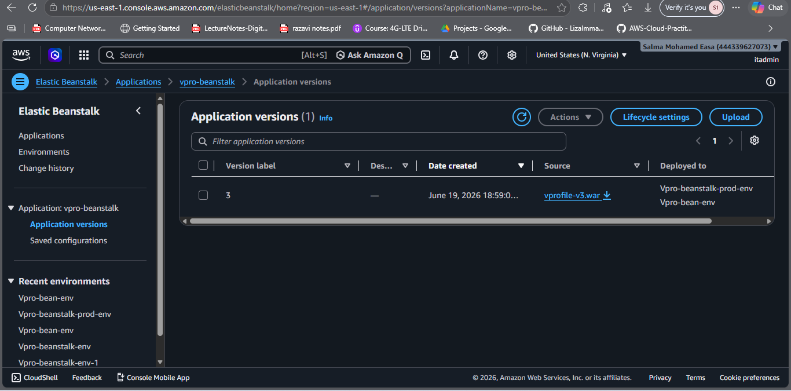
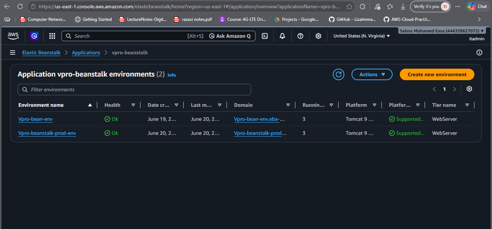

### Stage Environment Running
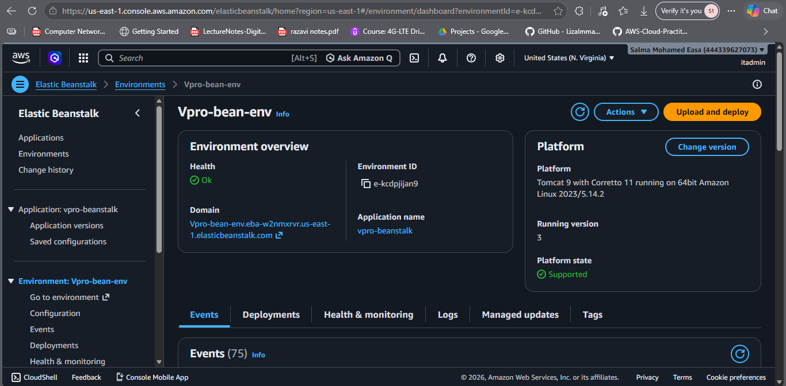

### Production Environment (Same Version as Staging)
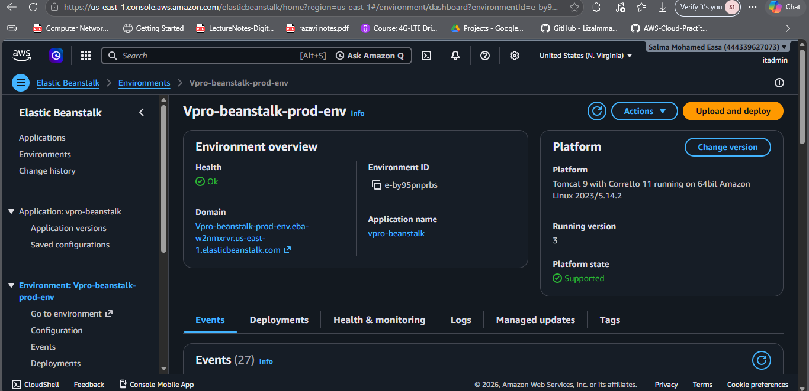

### Auto Scaling Groups
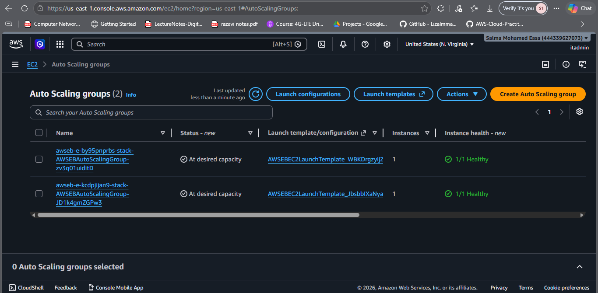

### Load Balancers
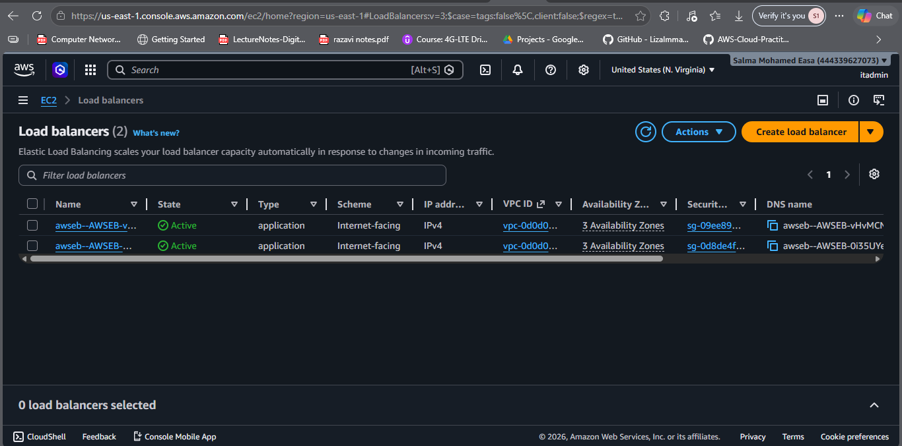

### All Running Instances
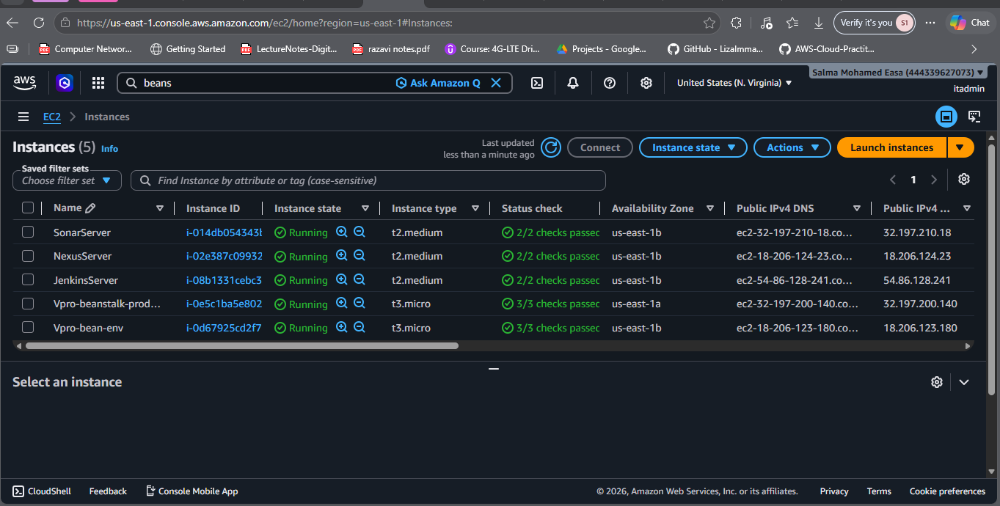

### Successful Production Pipeline
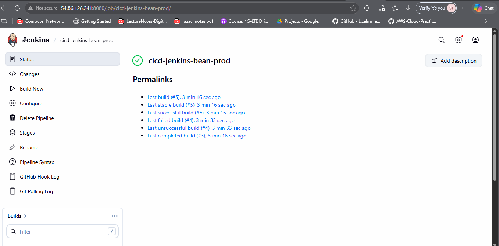

### Login Page — Staging
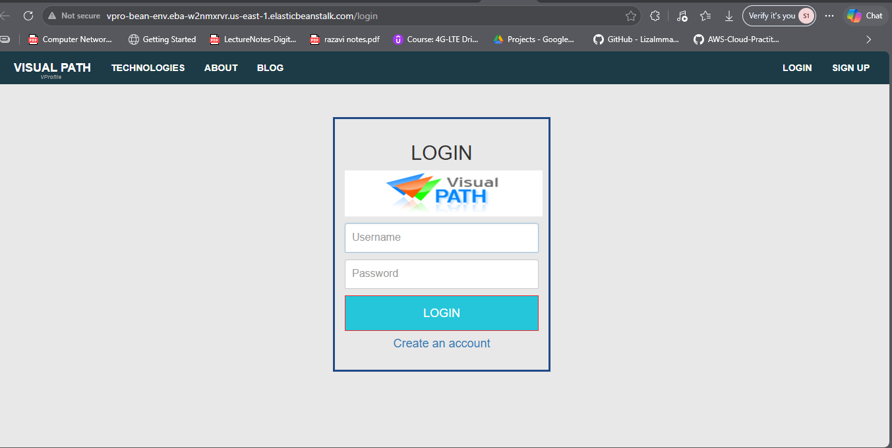

### Login Page — Production
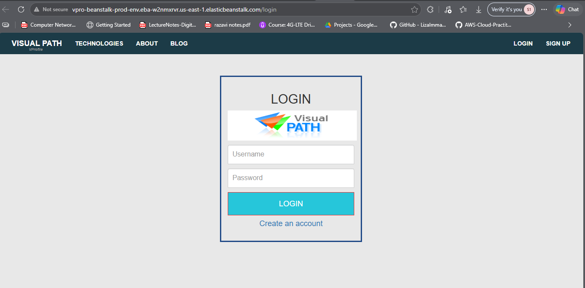

### Slack Notification
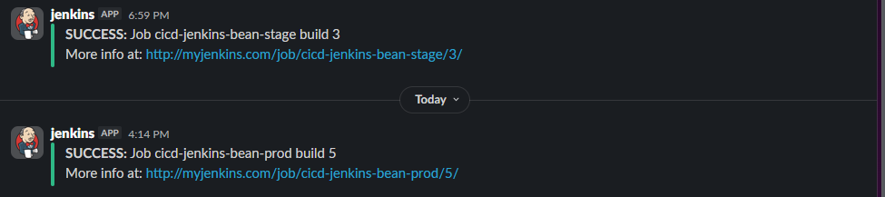
